# Raspberry Pi 4 ROS2 Ubuntu 20.04 Headless Wi-Fi SSH & VNC Setup Tutorial

## 1. Overview
Read a few steps ahead before executing. It might contain error fixes or examples which might be helpful

### Hardware
- Raspberry Pi 4 Model B (RPi 4)
- 32GB microSD card (16GB or more recommended)
- Power supply 5V 3A Type-C (phone charger)
- Wi-Fi router
- Windows 10 computer

### Software
- Ubuntu Server 20.04.x LTS 64-bit with Desktop
- belenaEtcher
- Powershell
- TightVNC and Remote Desktop Connections
- ROS2 Foxy

## 2. Flash Ubuntu image onto SD card

1. Get Ubuntu Server 20.04.x LTS 64-bit image from official site: <https://ubuntu.com/download/raspberry-pi>

    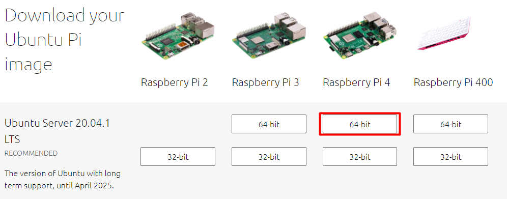

2. Get belenaEtcher from the official site: <https://www.balena.io/etcher/>

    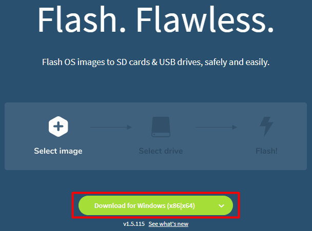

3. Open belenaEtcher

   

4. Press **Flash from file**
5.  Select Ubuntu image downloaded at step 1
    - e.g *ubuntu-20.04.1-preinstalled-server-arm64+raspi.img.xz*
    - or *ubuntu-20.04.1-preinstalled-server-arm64+raspi.img* (if [file extensions](https://vtcri.kayako.com/article/296-view-file-extensions-windows-10) are hidden)
    - Do NOT unzip
6.  Press **Select target**
7.  Select your SD card
    - e.g. *Mass Storage Device USB Device 32GB D:\\,E\\*
8.  Press **Flash!**
9.  Wait till flashing is done

## 5. Setup SD card 
### Configuring network files to automatically connect to Wi-Fi 
---
[Source](https://raspberrypi.stackexchange.com/questions/111722/rpi-4-running-ubuntu-server-20-04-cant-connect-to-wifi/113642#113642)

1. Reconnect SD card
2. Open SD card **system-boot** (Note: *USB Drive* can't be opened in Windows)


3. Open **network-config** file with any notepad application. I recommend Sublime Text because it shows spaces when text is selected. Both files has to have Unix (LF) line endings
4. Delete everything in *network-config* file
5. Copy and paste the text below to *network-config* file 
      ```
      # This file contains a netplan-compatible configuration which cloud-init
      # will apply on first-boot. Please refer to the cloud-init documentation and
      # the netplan reference for full details:
      #
      # https://cloudinit.readthedocs.io/
      # https://netplan.io/reference
      #
      # Some additional examples are commented out below

      version: 2
      wifis:
        wlan0:
          dhcp4: true
          optional: true
          access-points:
            "HUAWEI-AB77":
              password: "myPassword123"
      #      myworkwifi:
      #        password: "correct battery horse staple"
      ```

      - **Note:** make sure to use 2 spaces and **no tabs** for indentation. Lines that start with # are comments and are ignored so correct spacing is not required also it can be deleted

          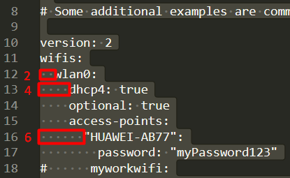

6. Change *HUAWEI-AB77* to your Wi-FI SSID and *myPassword123* to Wi-Fi password
      - SSID is Wi-Fi name it can be found by pressing Wi-Fi icon at the bottom right corner of the screen
  
          

          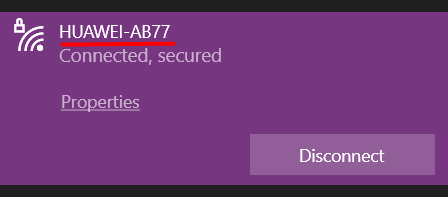

      - Alternatively it can be found by executing Powershell command <br>
    `(get-netconnectionProfile).Name`
7. Save *network-config* file
8. Open and append **user-data** file with text below (don't copy first 2 lines it's already in the file). **Warning:** make sure to use 2 spaces and **no tabs** for indentation
    ```
    # ...
    #- [ wget, "http://ubuntu.com", -O, /run/mydir/index.html ]

    ##Reboot after cloud-init completes
    power_state:
      mode: reboot
    ```
    <details> <summary>Example of <b>user-data</b> file. Only last lines are changed <b>(Click to expand)</b> </summary>

        #cloud-config

        # This is the user-data configuration file for cloud-init. By default this sets
        # up an initial user called "ubuntu" with password "ubuntu", which must be
        # changed at first login. However, many additional actions can be initiated on
        # first boot from this file. The cloud-init documentation has more details:
        #
        # https://cloudinit.readthedocs.io/
        #
        # Some additional examples are provided in comments below the default
        # configuration.

        # On first boot, set the (default) ubuntu user's password to "ubuntu" and
        # expire user passwords
        chpasswd:
          expire: true
          list:
          - ubuntu:ubuntu

        # Enable password authentication with the SSH daemon
        ssh_pwauth: true

        ## On first boot, use ssh-import-id to give the specific users SSH access to
        ## the default user
        #ssh_import_id:
        #- lp:my_launchpad_username
        #- gh:my_github_username

        ## Add users and groups to the system, and import keys with the ssh-import-id
        ## utility
        #groups:
        #- robot: [robot]
        #- robotics: [robot]
        #- pi
        #
        #users:
        #- default
        #- name: robot
        #  gecos: Mr. Robot
        #  primary_group: robot
        #  groups: users
        #  ssh_import_id: foobar
        #  lock_passwd: false
        #  passwd: $5$hkui88$nvZgIle31cNpryjRfO9uArF7DYiBcWEnjqq7L1AQNN3

        ## Update apt database and upgrade packages on first boot
        #package_update: true
        #package_upgrade: true

        ## Install additional packages on first boot
        #packages:
        #- pwgen
        #- pastebinit
        #- [libpython2.7, 2.7.3-0ubuntu3.1]

        ## Write arbitrary files to the file-system (including binaries!)
        #write_files:
        #- path: /etc/default/keyboard
        #  content: |
        #    # KEYBOARD configuration file
        #    # Consult the keyboard(5) manual page.
        #    XKBMODEL="pc105"
        #    XKBLAYOUT="gb"
        #    XKBVARIANT=""
        #    XKBOPTIONS="ctrl: nocaps"
        #  permissions: '0644'
        #  owner: root:root
        #- encoding: gzip
        #  path: /usr/bin/hello
        #  content: !!binary |
        #    H4sIAIDb/U8C/1NW1E/KzNMvzuBKTc7IV8hIzcnJVyjPL8pJ4QIA6N+MVxsAAAA=
        #  owner: root:root
        #  permissions: '0755'

        ## Run arbitrary commands at rc.local like time
        #runcmd:
        #- [ ls, -l, / ]
        #- [ sh, -xc, "echo $(date) ': hello world!'" ]
        #- [ wget, "http://ubuntu.com", -O, /run/mydir/index.html ]

        ##Reboot after cloud-init completes
        power_state:
          mode: reboot

    </details>

8. Save *user-data* file
9. Close notepad and remove sd card

## 6. First Raspberry Pi boot

1. Power off RPi
2. Insert SD card into RPi
3. Power on RPi. Green LED should blink while booting
4. For first boot **WAIT FOR 5min** (or longer) before continuing to next step. After some time RPi should automatically connect to Wi-Fi

## 7. Connecting to RPi using SSH
### SSH - Secure SHell. It's a network protocol which allows secure communication between two computers
---
To SHH into Raspberry Pi we need to 3 things: username, password and IP address of RPi which will be used in Powershell command as:
```
ssh username@IPAddress
```
**Note:** to paste in Powershell press right mouse button

*Note: for more advanced users I recommend [Windows Terminal](https://www.microsoft.com/en-us/p/windows-terminal/9n0dx20hk701?activetab=pivot%3Aregionofsystemrequirementstab). It has nicer interface*
1. By default on new Ubuntu installation username: *ubuntu*, password: *ubuntu*
2. Find IP address of RPi ([source](https://roboticsbackend.com/install-ubuntu-on-raspberry-pi-without-monitor/#Flash_Ubuntu_image_into_a_micro_SD_card))
    1. Download Advanced IP Scanner <https://www.advanced-ip-scanner.com/>
    2. Press Scan and wait for 2 minutes
    3. Find and copy RPi ip address e.g *192.168.8.106*. Raspberry Pi MAC address format is DC:A6:32:xx:xx:xx
        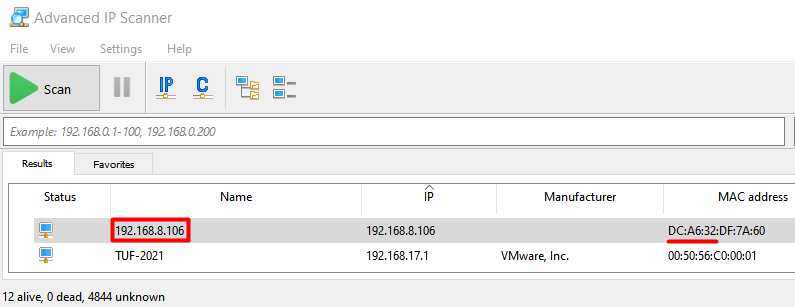

    4. If RPi is not found stop the scan and scan again a few times (scanning can take a few minutes)
    5. If RPi have gray monitor icon power off and power on RPi wait few minutes and repeat scanning now it should show blue monitor icon

        

   -  [Alternatively](https://www.howtogeek.com/204057/how-to-see-who%E2%80%99s-connected-to-your-wi-fi-network) connect to your router and find all connected devices one of which is RPi and copy IP address
3. Connect to RPi with SHH
    1. Open Powershell (by search or by right clicking Windows icon at the bottom left corner)
   
        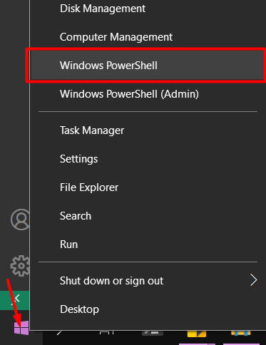

   1. Run command in Powershell (change IP address accordingly). Type `yes` if requested.
        ```
        ssh ubuntu@192.168.8.106
        ```

        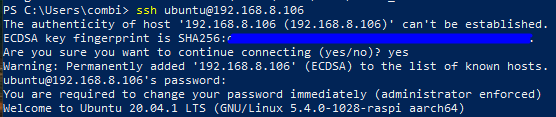

       - In case of error: `WARNING: REMOTE HOST IDENTIFICATION HAS CHANGED!` run
            ```
            ssh-keygen -R 192.168.8.106
            ssh ubuntu@192.168.8.106
            ```
        - If it's still not connecting check steps before for any error or google the error. Also it might be necessary to start from the beginning and re-flash Ubuntu image
        
    2. It will ask for password. Type `ubuntu`. Note star "*" symbols won't appear due to security reasons but it's still typing
    3. After login it's required to change password. After changing password ssh gets disconnected. To reconnect repeat `ssh ubuntu@192.168.8.106` command. Now terminal should display `ubuntu@ubuntu: $` if not something went wrong.
    4. Run `lsb_release -a`. Output should be:
   
        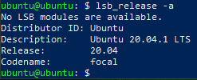

    - Password can be changed with `passwd myUserName` e.g.
        ```
        passwd ubuntu
        ```

## 8. Installing desktop environment and setting up VNC server

1. `ubuntu@ubuntu:~$` should be shown in terminal if not connect to Raspberry Pi via SSH. How to do that is described in a previous chapter. Hint: `ssh ubuntu@192.168.8.106`
2. Copy paste commands below line by line press enter to run. It will install desktop environment. To paste in Powershell press right mouse button
    ```
    sudo apt update && sudo apt -y upgrade
    sudo apt install -y tasksel
    sudo tasksel install ubuntu-desktop-minimal
    ```
    - In case of problem: `Waiting for cache lock: Could not get lock /var/lib/dpkg/lock frontend.` Power off and power on RPi, wait ~2 min for it to boot and connect via SSH by running `ssh ubuntu@192.168.8.106` in Powershell. Repeat failed command which could not be finished due to cache lock. Repeating *apt install* command won't do anything if package is already installed so it's safe. 
    - [Alternative cache lock fix (no reboot)](https://stackoverflow.com/a/64909820/5031366)
        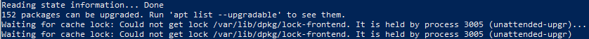
3. Install VNC server
    ```
    sudo apt install -y xrdp
    sudo apt install -y tightvncserver
    ```
4. Reboot Raspberry Pi
5. On Windows 10 computer open search for *Remote Desktop Connections* application

    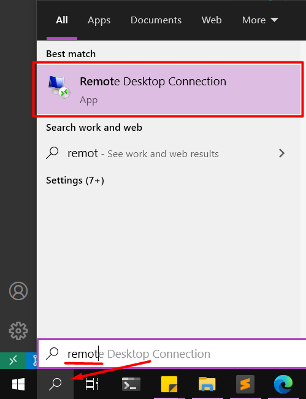

6. Specify IP address of RPi. It's the same address as for SSH connection. e.g 192.168.8.106
   
   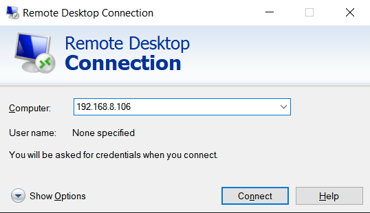

7. Credentials can be saved for next session by pressing *Show Options*, entering *User name* and checking *Allow me to save credentials*

    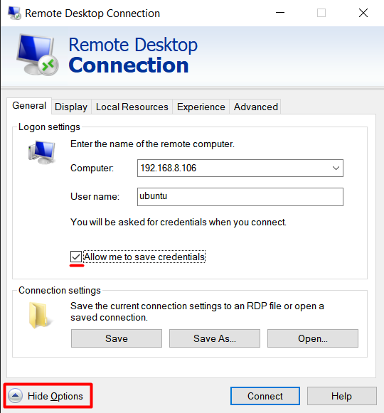

8. Press *Connect* and select **Xorg**, username: **ubuntu** and password: **yourChangedPassword**. Press *OK* and wait a minute for black window to load

    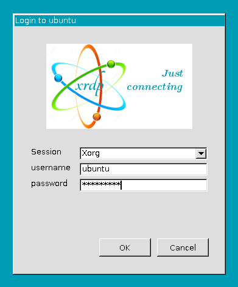

9.  To open Ubuntu terminal press **Ctrl+Alt+T**

    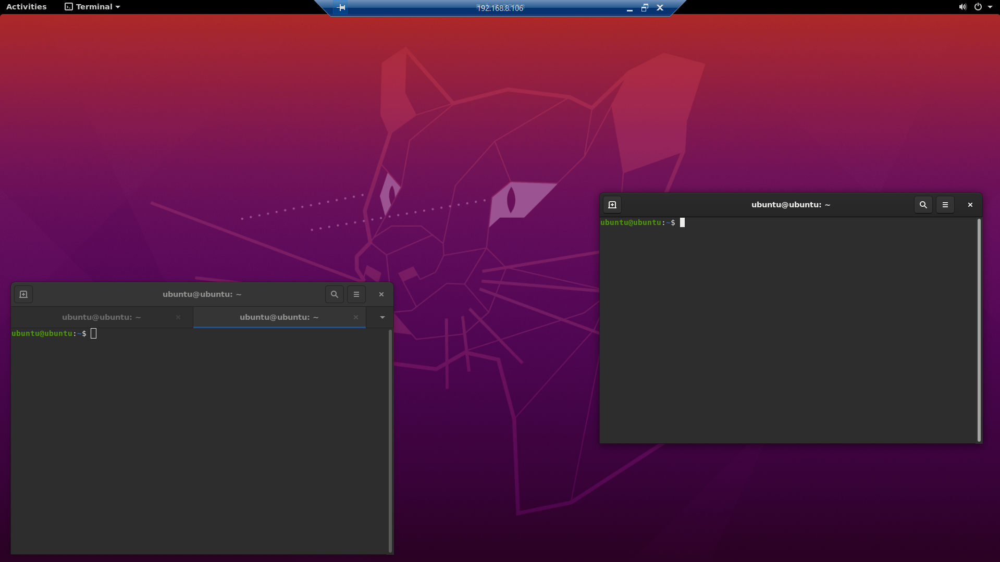

    - For dark theme press top right menu icon -> Preferences -> General -> Theme variant: Dark
    -  To open terminal in new tab press Ctrl+Shift+T
10. To open more GUI applications press *Activities* at the top left corner and icon at the bottom left
11. If GUI run slow lower screen resolution in *Remote Desktop Connections* application before entering IP address by going to Show Options -> Display and sliding slider to small size. 1280x720 and 16 bit color depth is a good compromise

    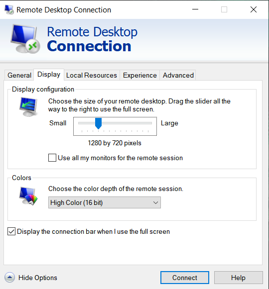

Sources:
- Other desktop alternatives: <https://linuxconfig.org/ubuntu-20-04-gui-installation>
- How to install tightvnc source: <https://sbcguides.com/install-tightvnc-server-on-raspberry-pi/>

## 9. Installing ROS2 Foxy

1. Further commands can be executed via VNC on Ubuntu terminal (Ctrl+Shift+T) or via SSH on Win10 machine both methods are equivalent. Run commands line by line (be careful with wrapped lines)
2. Setup locale
    ```
    sudo locale-gen en_US en_US.UTF-8
    sudo update-locale LC_ALL=en_US.UTF-8 LANG=en_US.UTF-8
    export LANG=en_US.UTF-8
    ```
3. Setup resources
    ```
    sudo apt update && sudo apt install -y curl gnupg2 lsb-release
    curl -s https://raw.githubusercontent.com/ros/rosdistro/master/ros.asc | sudo apt-key add -
    sudo sh -c 'echo "deb [arch=$(dpkg --print-architecture)] http://packages.ros.org/ros2/ubuntu $(lsb_release -cs) main" > /etc/apt/sources.list.d/ros2-latest.list'
    ```
4. Install ROS2 and helper packages
    ```
    sudo apt update
    sudo apt install -y ros-foxy-desktop
    sudo apt install -y python3-colcon-common-extensions
    sudo apt install -y python3-argcomplete
    ```
5. Setup ROS2
    ```
    echo "source /opt/ros/foxy/setup.bash" >> ~/.bashrc
    source ~/.bashrc
    ```
6. Check if installation successful by connecting VNC server (via Remote Desktop Connections) opening terminal (Ctrl+Shift+T) and running
    ```
    rviz2
    ```

    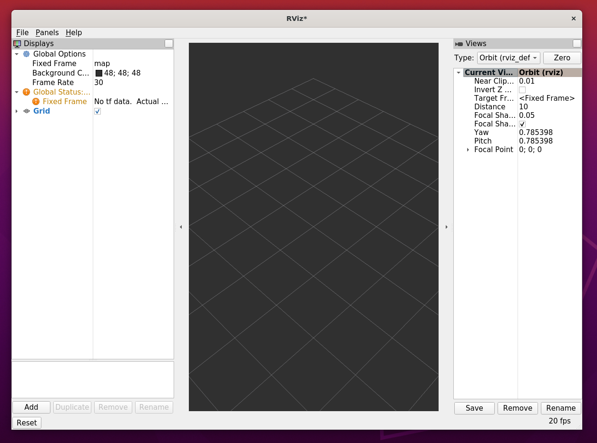

  Source: <https://roboticsbackend.com/install-ros2-on-raspberry-pi/>

</br>

# That's It!
